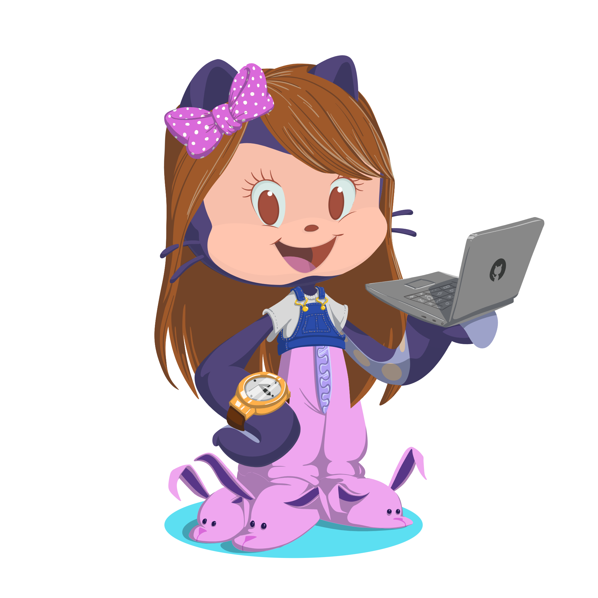
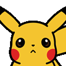

<!--  -->

<!--Night Owl image-->

  

<!--Header Name-->
#  Hi, I'm Niwarthana Sathyanjali! 
*Software Enigneer*
  

<!--Start Intro-->               

Hi 👋 I'm a Full-Stack Developer and Machine Learning enthusiast who loves turning ideas into clean, fast, and user-friendly applications.

Passionate about Python, React, Next.js, Node.js, NestJS, Django, Flutter (and FlutterFlow), Supabase, and crafting intuitive UI/UX with impactful data visualizations. 

Always learning, always building 🚀

- ✨ Lifelong learner — every line of code teaches something new.
- 🌱 Constantly exploring the latest tools and techniques; no day passes without growth.

  

<!--Footer-->  
<!-- color=gradient / color=auto -->

  

